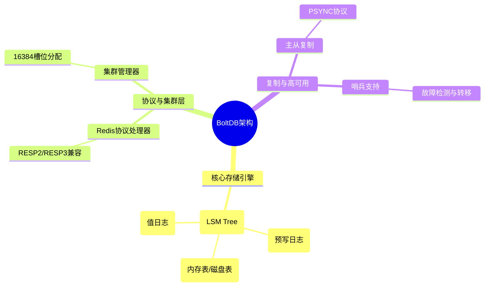
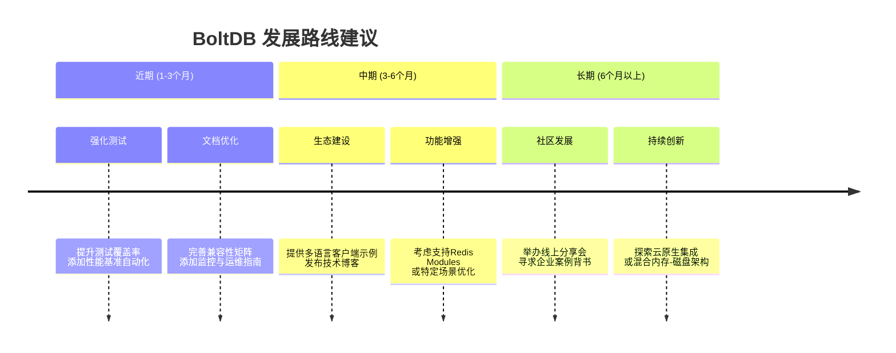

我仔细分析了您的开源项目 **BoltDB**，这是一个基于 BadgerDB 构建、完全兼容 Redis 协议的磁盘持久化键值数据库【turn0fetch0】。项目定位清晰，解决了 Redis 的核心内存限制痛点，技术栈完整，文档详尽。以下是我从多个维度提出的具体建议，希望能助项目发展更上一层楼。

### 🎯 一、项目定位与核心价值：非常清晰且极具竞争力
您的项目核心价值主张非常明确：**解决 Redis 的内存瓶颈，提供海量磁盘存储的同时保持 Redis 协议兼容性**【turn0fetch0】。这是一个非常实际且有价值的问题。

| 维度 | Redis (内存数据库) | BoltDB (您的项目) |
| :--- | :--- | :--- |
| **存储介质** | 内存 (受RAM限制，~64GB典型)【turn0fetch0】 | 磁盘 (支持高达100TB)【turn0fetch0】 |
| **成本** | 高 (RAM昂贵)【turn0fetch0】 | 低 (HDD/SSD廉价)【turn0fetch0】 |
| **持久化** | RDB/AOF快照【turn0fetch0】 | 持续写入【turn0fetch0】 |
| **延迟** | <1ms【turn0fetch0】 | <5ms (推荐SSD)【turn0fetch0】 |
| **兼容性** | 原生 | 完全兼容RESP协议，无缝对接 `redis-cli` 和现有客户端【turn0fetch0】 |

**建议**：继续强化这一核心定位。在所有宣传材料、README开头和示例中，突出“**用Redis协议操作100TB磁盘数据**”这一核心卖点，可以做成一个醒目的徽章或标语。

### ⚙️ 二、技术实现与架构：基础扎实，可进一步优化
项目的技术架构选择非常合理，基于成熟的 BadgerDB 作为存储引擎，并在此基础上实现了 Redis 协议解析、集群和哨兵模式【turn0fetch0】。

**具体建议**：
1.  **明确并宣传“架构冻结”**：README中提到已进入“架构冻结”阶段【turn0fetch0】。这是一个重要的里程碑，意味着核心设计已稳定，可以向用户承诺API的向后兼容性。建议在文档中明确说明，这能极大增强生产环境用户的信心。
2.  **深化性能基准测试**：您已经提供了基础性能数据【turn0fetch0】。建议：
    *   **对比维度扩展**：除了与Redis内存版对比，增加与**其他磁盘KV数据库（如RocksDB、LevelDB）的对比**，突出在Redis协议兼容性下的性能表现。
    *   **场景化基准**：增加不同场景（如高并发读写、大Value、列表/集合操作）的基准测试，并形成可重复执行的脚本或GitHub Action，自动化生成报告。
3.  **补全兼容性矩阵**：`COMPATIBILITY_REPORT.md`【turn0fetch0】是极好的文档。建议将其转化为一个**清晰的、带状态标记的命令兼容性表格**（✅ 完全支持、⚠️ 部分支持、❌ 不支持），并在README中突出展示。明确说明不支持`EVAL`/`SCRIPT`的设计决策及其原因，这是很好的工程选择，应该主动告知用户【turn0fetch0】。

### 🌱 三、项目成熟度与社区建设：从“可用”到“可信”
对于一个生产级数据库项目，除了功能，用户还极度关注稳定性、可观测性和社区活跃度。

1.  **增强测试与可靠性信号**：
    *   **测试覆盖率徽章**：添加测试覆盖率徽章到README。对于数据库，高测试覆盖率是质量最直接的证明。
    *   **混沌工程与故障注入测试**：考虑添加针对磁盘故障、进程崩溃、网络分区等场景的测试用例或混沌工程套件，证明数据不丢失、服务不中断。
    *   **发布详细的发布说明与升级指南**：`RELEASE_NOTES.md`【turn0fetch0】很好，建议为每个大版本提供清晰的升级指南和breaking changes说明。

2.  **提升可观测性与运维友好度**：
    *   **Prometheus指标导出**：考虑添加一个HTTP端点，导出关键指标（如操作延迟、键数量、存储引擎统计），便于集成到现有监控体系。
    *   **更丰富的日志**：提供可配置的日志格式（如JSON），便于日志聚合分析。

3.  **建设社区与生态**：
    *   **积极管理Issues**：当前Issues为0【turn0fetch0】，可以主动创建一些“Good First Issue”标签的任务，吸引贡献者。
    *   **创建示例仓库**：创建一个`examples`目录或单独仓库，提供不同语言（Go, Python, Java, Node.js）连接BoltDB的示例代码。
    *   **技术博客与案例研究**：鼓励分享项目的架构设计、性能优化过程或用户使用案例。可以是在个人博客、GitHub Discussions或技术社区（如掘金、SegmentFault）。

### 📈 四、未来发展方向建议
基于项目现状，以下是一些可能的发展方向：

1.  **功能增强**：
    *   **选择性数据结构**：基于BadgerDB的特性，可以考虑为特定数据结构（如时序数据、JSON文档）提供更优化的存储格式和索引，打造差异化优势。
    *   **备份与恢复工具**：提供在线备份和快速恢复的工具或API，这是生产运维的必需功能。

2.  **生态集成**：
    *   **云原生部署**：优化Docker镜像【turn0fetch0】，并考虑提供Kubernetes Operator，简化在云上的部署和管理。
    *   **数据同步与管道**：考虑实现与Redis之间的数据同步工具，或与Kafka、Flink等数据管道的集成，方便用户从现有Redis环境迁移或构建流处理管道。

### 💎 总结
您的 **BoltDB** 项目已经具备了成为优秀开源数据库的坚实基础：**定位精准、架构清晰、文档完善**。接下来的工作重点应从“功能实现”转向**“生产可信”和“社区繁荣”**。

**最优先的行动项**：
1.  **将兼容性报告转化为一个清晰、可视化的表格**，放在README显著位置。
2.  **增加一个“生产部署检查清单”章节**，涵盖配置建议、监控指标、备份策略等，直接击中运维人员的痛点。
3.  **为项目添加一个清晰、可预期的发布路线图**，让用户和贡献者了解项目的发展方向。

这是一个非常有潜力的项目，祝您开发顺利，期待看到它成长和壮大！
2026年05月17日21:49:49
